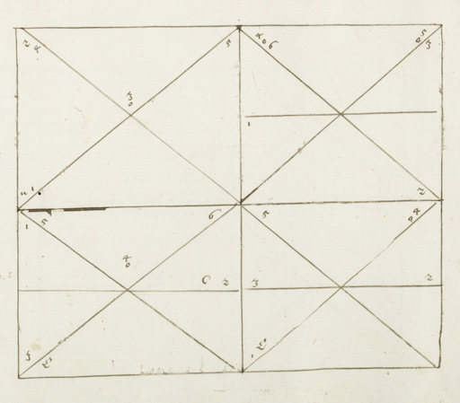

# hfd
## Historical Fencing Drills app

This is a Kivy app to help in performing individual historical fencing drills.

In the 1560s, Joachim Meyer created a manuscript for one of his private students, 
providing instruction in longsword, dussack, and side sword. Though less extensive 
than Meyer's later 1570 publication, the early manuscript contained several cutting 
diagrams that serve as a useful basis for constructing individual drills.

This app adapts those cutting diagrams to provide audio callouts of cut and 
thrust combinations to serve for individual training. The app assumes a 
simplified system of eight cuts and 9 thrusts. The cuts are illustrated here, 
witih the cut begining at the position of its respective number and continuing 
along the line that extends from that number. (This differs from the user interface, 
where the yellow dot marks where the cut should end.)

The thrusts are illustrated here. In most cases, they are called out by the same 
number as their corresponding cut, with the word 'thrust' afterwards. The once 
exception is the '9', which is a thrust to the center of the body.

The app provides multiple ways to adjust the training program:

 - **Round duration (minutes):** the amount of time you want to train for.
 - **Pause between calls (seconds):** the number of seconds to wait calling 
   out the next cut or thrust.
 - **Pause between combos (seconds):** the number of seconds to wait after a 
   combination of multiple cuts and/or thrusts have been called out.
 - **Progressively expand combos:** if ON, the app will start by calling out 
   the first two moves of the combo, then expand to three, then four, and so on, 
   until the full combo is recited.
 - **Repeat full combo at end:** the number of times to repeat the combo before 
   moving on to the next one. If progressive expansion is on, then the repetition 
   will only apply to the full combo, not each progressive subset.
